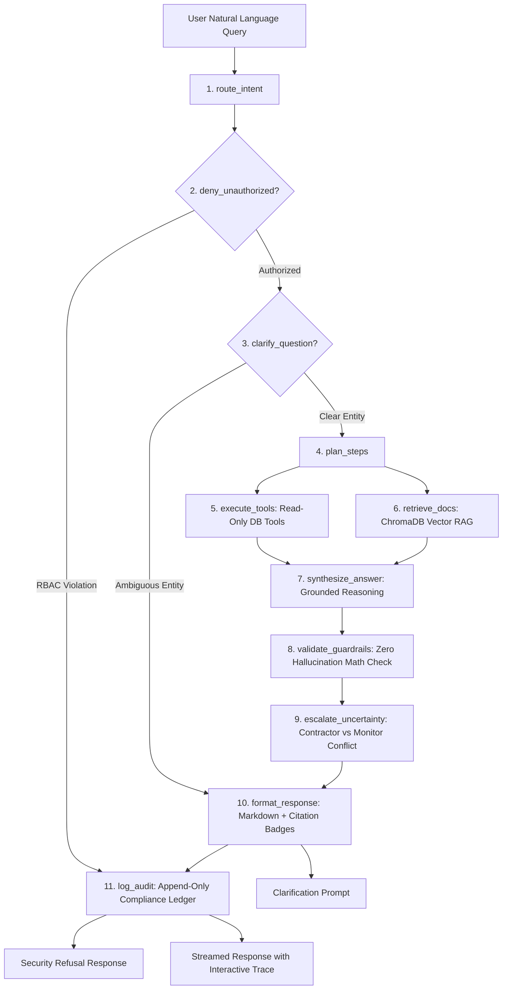

# Bharat Project Intelligence (भारत परियोजना प्रज्ञा)

**AI-Powered Integrated Government Project Monitoring & Decision Support Platform**  
*Prototype designed for Smart India Hackathon (SIH)*  
*Badge:* **Synthetic Demonstration Data — For Prototype Purposes Only**

---

## 🏛️ Executive Summary

**Bharat Project Intelligence** is an enterprise-grade Decision Support System (DSS) tailored for the Government of India, Cabinet Secretariat, Project Monitoring Group (PMG), and central infrastructure ministries (MoRTH, Railways, MoHUA, Power, Jal Shakti, MNRE).

It eliminates subjective delays and communication silos by combining:
1. **Authoritative EVM Analytics**: Single-source-of-truth calculations for Schedule Performance Index (SPI), Cost Performance Index (CPI), Estimate at Completion (EAC), and Financial-Physical Lead Gaps.
2. **Machine Learning Risk Engine**: GradientBoosting & XGBoost models predicting delay duration (in days) and cost overrun percentage with SHAP feature explainability.
3. **Retrieval-Augmented Generation (RAG)**: Semantic vector retrieval over DPRs, regional site inspection notes, contractor monthly filings, and statutory circulars.
4. **11-Node LangGraph Agent**: A deterministic, guardrailed agent with strict RBAC gating, numerical accuracy verification, and clickable evidence citations.

---

## 🎯 11 Dedicated Screens & Capabilities

| # | Screen | Description |
|---|---|---|
| 1 | **Executive Dashboard** | High-level portfolio KPIs (₹ Outlay, Total Projects, Avg SPI/CPI), interactive SVG India State Choropleth Map, high-risk spotlight, and sector outlay distribution. |
| 2 | **Project Portfolio** | Searchable and filterable registry across 18 states, 13 sectors, and 4 risk bands with CSV export and EVM health pills. |
| 3 | **Project 360° Deep-Dive** | Comprehensive drill-down on any project featuring **P-102** (Tamil Nadu Highway Corridor), S-Curve, EVM breakdown, Milestones timeline, and Risk Matrix. |
| 4 | **Early Warning Center** | Proactive alert dispatch center enforcing 3 statutory triggers: $SPI < 0.85$, Financial Gap $> 15\%$, and ML Risk $\ge 60/100$, with escalation workflows. |
| 5 | **AI Intelligence Assistant** | Full conversational hub featuring the **11-Node LangGraph Trace Viewer**, zero-hallucination guardrails, and clickable ground citation chips. |
| 6 | **ML Predictive Lab** | Interactive What-If Scenario Simulator with live sliders for progress, spend, land delays, clearances, and SHAP feature attribution bars. |
| 7 | **Compare Projects** | Side-by-side comparative benchmarking of 2–3 projects across budgets, EVM metrics, delivery variances, and critical path blockers. |
| 8 | **Document Library (RAG)** | Full-text repository of 12 statutory documents (DPRs, Inspection Reports, Meeting Minutes) with highlighted vector chunks. |
| 9 | **Spatial GIS Map** | Pan-India spatial intelligence view with state-level outlay leaderboards and corridor pins. |
| 10 | **Executive Briefs Generator** | Automated compiler for Cabinet Committee on Infrastructure (CCI) notes, Parliamentary Starred Question replies, and printable PDF briefs. |
| 11 | **Compliance & Audit Console** | Immutable security ledger of all queries, user role switches, model executions, and diagnostic system health metrics. |

---

## 🔬 Featured Worked Example: Project P-102

- **Project Code:** `P-102`
- **Name:** *Four-Laning of National Highway Corridor Package - Demo*
- **Ministry & Agency:** Ministry of Road Transport and Highways (MoRTH) / NHAI
- **Location:** Tamil Nadu (Madurai - Tirunelveli Section, 78.4 km)
- **Approved Cost (BAC):** ₹1,250.00 Cr | **Revised Cap:** ₹1,380.00 Cr
- **Cumulative Expenditure (AC):** ₹1,050.00 Cr (84.0% drawdown)
- **Physical Progress:** 58.2% Actual vs 74.5% Planned (**-16.3% deficit**)
- **Schedule Performance Index (SPI):** **0.78** (Critical delay threshold < 0.85 breached)
- **Financial-Physical Lead Gap:** **+25.8% points** (Expenditure outpacing verified paving)
- **Schedule Slippage:** **92 Days** (Target completion pushed from March 31, 2025 to July 1, 2025)
- **Root Cause Evidence:**
  1. *Stage-II Forest Clearance Deadlock:* 14.2 ha fringe land between Km 52+400 and 61+200 pending clearance from Regional Forest Bench, Chennai.
  2. *Utility Shifting:* 33kV high-tension power line relocation delayed by 115 days over TANGEDCO supervision fee dispute.
  3. *Contractor Contradiction:* Concessionaire claims unseasonal rain days in Western Ghats, while Regional Quality Monitor cites idle machinery and cash flow constraints.

---

## 🤖 11-Node LangGraph Multi-Agent Architecture

---

## 👥 Demo Personas & RBAC Scopes

Switch personas in the top right header to test access control gates:
1. **National Super Administrator** (`superadmin@demo.gov`): Unrestricted national scope across all 18 states and 13 ministries.
2. **Ministry Monitoring Officer** (`officer@demo.gov`): Scoped to MoRTH national projects.
3. **NHAI Project Authority (Tamil Nadu)** (`authority@demo.gov`): Scoped to MoRTH / NHAI projects in Tamil Nadu (queries outside Tamil Nadu trigger security refusals).
4. **Senior Government Decision Maker** (`decisionmaker@demo.gov`): Strategic overview for PMO / Cabinet Committee on Infrastructure.

---

## 📊 Earned Value Management (EVM) Formulas

- **Planned Value ($PV$):** $BAC \times \text{Planned Physical } \%$
- **Earned Value ($EV$):** $BAC \times \text{Actual Physical } \%$
- **Schedule Performance Index ($SPI$):** $\frac{EV}{PV}$ (Critical when $< 0.85$)
- **Cost Performance Index ($CPI$):** $\frac{EV}{AC}$
- **Schedule Variance ($SV$):** $EV - PV$
- **Cost Variance ($CV$):** $EV - AC$
- **Estimate at Completion ($EAC$):** $\frac{BAC}{CPI}$
- **Variance at Completion ($VAC$):** $BAC - EAC$
- **Financial-Physical Gap:** $\text{Expenditure } \% - \text{Actual Physical } \%$ (Alert triggered when $> 15\%$)

---

## ⚖️ Statutory Notice
All data, project names, and document excerpts are **synthetic demonstration models** created exclusively for prototype evaluation during Smart India Hackathon. Machine learning risk ratings and delay forecasts are advisory analytical estimates and do not represent contractual findings.
