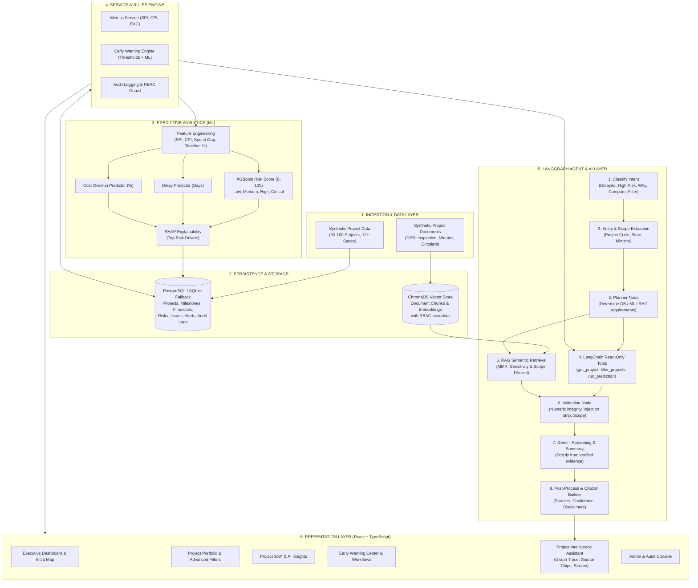

# Bharat Project Intelligence — System Architecture

**AI-Powered Integrated Government Project Monitoring & Decision Support Platform**  
*Prototype designed for Smart India Hackathon (SIH)*  
*Badge:* **Synthetic Demonstration Data**

---

## 1. High-Level Architecture Diagram

---

## 2. Non-Negotiable Separation of Responsibilities

| Subsystem | Authority / Scope | Constraint / Guardrail |
|---|---|---|
| **Database & Services** | **Single source of truth** for all numbers, milestones, expenditures, and approved budgets. | Parameterized queries only. Free-form SQL is strictly prohibited. |
| **ML Engine** | **Prediction and forward-looking analytics** (risk score 0-100, delay days, cost overrun %, SHAP factors). | Every ML output is strictly labelled: *"AI Prediction, not a confirmed fact"*. |
| **RAG Pipeline** | **Qualitative ground evidence** from verified project documents (DPR, inspection remarks, clearance letters). | Scoped by user ministry/state/role; all retrieved chunks wrapped in untrusted data delimiters. |
| **Gemini LLM** | **Explanation, summarisation, and narrative reasoning** over verified tool results and retrieved document chunks. | **Never computes official figures directly.** Cannot invent facts. Strictly constrained to supplied context. |
| **LangGraph Agent** | **Controlled deterministic workflow** (Intent → Planning → Retrieval/Tools → Evidence Validation → Generation → Citation). | Halts with *"Insufficient verified project data is available to answer this question"* if evidence is below threshold. |
| **Audit & Security** | **Complete traceability** for every action, query, retrieval, and status change. | RBAC enforced in API routes, DB queries, and AI tool execution. |

---

## 3. Data Processing & Retrieval Flow

1. **Transaction / Ingestion Flow:**  
   Project authorities submit progress updates, financial releases, or upload documents. Progress percentages and dates are verified against mathematical sanity bounds (progress cannot decrease without justification).

2. **Early-Warning Engine:**  
   Calculates SPI ($SPI = \frac{\text{Actual Physical \%}}{\text{Planned Physical \%}}$), CPI ($CPI = \frac{\text{Actual Physical \%}}{\text{Financial Progress \%}}$), and financial-physical gap. If $SPI < 0.85$ or gap $> 15$ points or ML Risk $\ge 60$, a structured alert is dispatched with evidence citations.

3. **Conversational Intelligence Flow:**  
   - User poses a query (e.g., *"Why is Project P-102 delayed?"*).
   - LangGraph classifies intent (`PROJECT_DELAY_WHY`) and extracts entity (`P-102`).
   - Tools fetch official metrics (SPI: 0.78, Gap: +22 points).
   - RAG searches indexed documents for `P-102` filtered by user's security level.
   - Validation node checks that metrics and document relevance pass minimum thresholds.
   - Gemini formats an explainable briefing citing document name, page number, and key metrics.
