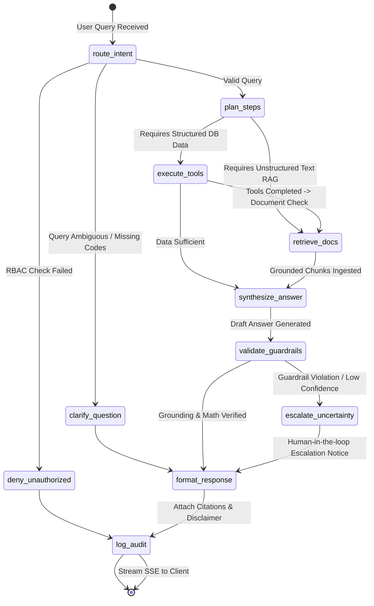

# LangGraph Multi-Node Multi-Agent Flow

*Bharat Project Intelligence AI Architecture*

---

## State Schema (`AgentState`)

| Field | Type | Description |
|---|---|---|
| `query` | `str` | User's natural language question |
| `user_role` | `str` | User RBAC role (e.g. `Government Officer`) |
| `user_scope` | `dict` | Scope constraints (`ministry_id`, `state_id`) |
| `intent` | `str` | Classified intent (`single_project`, `cross_project_compare`, `early_warning`, `aggregate_query`, `rag_document_search`) |
| `plan` | `List[str]` | Generated execution steps |
| `tool_outputs` | `Dict[str, Any]` | Outputs collected from the 16 typed LangChain tools |
| `retrieved_docs` | `List[Dict]` | Grounded document chunks from ChromaDB with citations |
| `draft_answer` | `str` | Initial synthesized response |
| `final_answer` | `str` | Verified, guardrailed response |
| `citations` | `List[Dict]` | Structured citation records (Doc Title, Page, Chunk) |
| `graph_trace` | `List[Dict]` | Node execution trace with latency and state transitions |
| `disclaimers` | `List[str]` | Mandatory statutory and synthetic watermarks |

---

## 11 Nodes Responsibilities

1. **`route_intent`**: Parses question, validates RBAC access against user scope, routes to appropriate execution branch.
2. **`deny_unauthorized`**: Emits security refusal when a scoped officer queries unauthorized state/ministry records.
3. **`clarify_question`**: Requests missing project codes or specific date bounds.
4. **`plan_steps`**: Deterministic step decomposition (e.g., fetch metrics $\to$ query risks $\to$ search inspection notes).
5. **`execute_tools`**: Invokes read-only LangChain tools against PostgreSQL.
6. **`retrieve_docs`**: Performs hybrid semantic vector search in ChromaDB, filtered by project code and document sensitivity.
7. **`synthesize_answer`**: Generates grounded executive briefing referencing tool data and document snippets.
8. **`validate_guardrails`**: Enforces zero-hallucination policy (checks all numbers against tool data; verifies disclaimer presence).
9. **`escalate_uncertainty`**: Flags unresolved contradictions between contractor reports and site inspection reports.
10. **`format_response`**: Formats output in clean Markdown with interactive citation badges.
11. **`log_audit`**: Commits full query, response, and tool trace to `audit_logs` table for compliance review.
